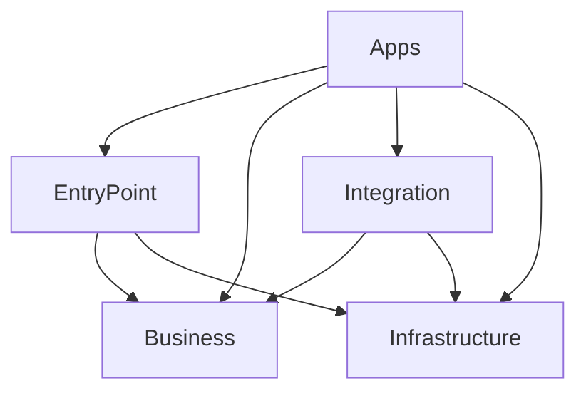

# Order Service — BBT Architectureによる注文管理サービス

注文の予約・確定、期限切れ予約の削除、日次の注文額の集計を行うアプリケーションである。注文データはPostgreSQLに保存し、確定済み注文の参照にはValkeyとプロセス内キャッシュを使う。APIとバッチの処理はOpenTelemetry（OTel）で記録し、OTel Collector経由でJaegerに送信する。

このAPIは、社内の信頼された呼び出し元が価格を指定する単一テナントのサービスを想定している。金額は日本円の整数で扱い、決済や在庫引当は実装していない。そのため、この例で集計する「売上」は確定した注文額を指し、入金額とは区別する。

## ローカル環境での起動と操作

起動と検証にはRust 1.94以上とDocker Composeを使用する。以下のコマンドは `examples/order-service` ディレクトリで実行する。

```sh
cp .env.example .env
set -a
. ./.env
set +a
docker compose up -d --wait
cargo run --locked --bin migrate
cargo run --locked --bin server
```

APIの接続先は `http://127.0.0.1:3000`、トレースを閲覧するJaegerの接続先は [http://localhost:16686](http://localhost:16686) である。`.env.example` のAPIキーと接続情報はローカル開発用の値を使っている。アプリケーションは `.env` を自動で読み込まないため、上の手順で環境変数を設定する。

APIを操作するには別のターミナルを開き、同じディレクトリで `.env` の環境変数を読み込んでから次のコマンドを実行する。予約IDは新しい予約ごとに生成するUUIDで、以下では操作例として固定値を使っている。

```sh
curl -i http://localhost:3000/readyz

curl -i http://localhost:3000/reservations \
  -H "Authorization: Bearer $API_KEY" \
  -H 'Content-Type: application/json' \
  -H 'traceparent: 00-4bf92f3577b34da6a3ce929d0e0e4736-00f067aa0ba902b7-01' \
  -d '{"id":"6e4b638e-18c9-454b-bff9-2c31a1b5cd17","sku":"BOOK-001","quantity":3,"unit_price_yen":1200}'

curl -i -X POST http://localhost:3000/reservations/6e4b638e-18c9-454b-bff9-2c31a1b5cd17/confirm \
  -H "Authorization: Bearer $API_KEY"

# ORDER_UUIDを注文確定の応答に含まれるidへ置き換える。
curl -i http://localhost:3000/orders/ORDER_UUID \
  -H "Authorization: Bearer $API_KEY"

cargo run --locked --bin cleanup -- --limit 1000
cargo run --locked --bin rebuild-sales -- --from 2026-09-01 --until 2026-09-03
curl -i http://localhost:3000/sales/2026-09-01 -H "Authorization: Bearer $API_KEY"
```

集計期間はUTCの日付で指定し、`from` を含み、`until` を含まない。上の例では9月1日と2日を集計する。集計できるのは前日までの完了した日付で、注文のない日には0件・0円の結果を保存する。

サーバーはCtrl-Cで終了する。Composeで起動したサービスは `docker compose down` で停止する。停止後もDBのデータはDockerボリュームに残る。

## ディレクトリ構成と依存方向

BBTの各領域をCargoのパッケージに分け、Appsで実行可能なアプリケーションとして組み立てる。コードの配置は次のとおりである。

```text
apps/                         # 実行可能なbin。部品の生成・接続・起動・終了
  server/                     # cargo run --bin server
  cleanup/                    # cargo run --bin cleanup
  rebuild-sales/              # cargo run --bin rebuild-sales
  migrate/                    # cargo run --bin migrate
src/
  business/                   # 1つのcrate内に業務機能ごとのモジュールを配置
  entrypoint/
    http/                     # HTTP入出力用の型・ルート・認証・エラー変換
    cli/                      # clapによる引数の読込・バッチ結果の表示
  integration/
    orders/                   # 予約・確定のSQL、業務型の変換、キャッシュの利用方針
    maintenance/              # 期限切れ予約の削除SQL
    reporting/                # 日次集計SQL、日付ごとの排他制御
  infrastructure/
    postgres/                 # 接続プール、タイムアウト、テーブル定義と変更の適用
    cache/                    # Moka・Valkeyによるバイト列のキャッシュ
    telemetry/                # OTelの初期化・トレースの伝播と送信、JSON形式のログ
    runtime/                  # 環境変数、終了シグナル、実行時間の制限
```

依存方向は次の図に従う。矢印は、依存する側から依存される側へ向けている。Entry PointとIntegrationが、外部との入出力を業務処理に接続するBoundaryに当たる。



Cargoワークスペースには14個のパッケージがあり、それぞれの `Cargo.toml` で依存先を宣言する。4つのAppは個別のパッケージに配置し、`[[bin]]` で実行ファイルを定義している。この分割により、Appごとに必要な依存を選べる。例えば `cleanup` の依存には、HTTPサーバーやキャッシュのcrateを含めていない。

各crateが直接参照できる外部crateは、`Cargo.toml` に宣言した依存先に限られる。Businessの依存先は `async-trait`、`chrono`、`thiserror`、`uuid` とし、HTTP・DB・キャッシュ・OTelを扱うcrateへの依存は宣言していない。Cargoはこの宣言に従って参照を制限する。依存先を追加するときは、上の依存図に沿っているかを確認する。

Businessの公開APIには、用途の異なる操作とtraitがある。Entry Pointは業務操作を呼び出すInbound APIを使い、IntegrationはBusinessが外部へ求める機能を定義したOutbound APIのtraitを実装する。Appsは生成・組み立て用のComposition APIを使う。ただし、同じBusiness crate内の公開APIについては、呼び出し元の領域ごとにアクセスを制限していない。

## 業務処理と境界の実装

### 予約と注文確定

注文のHTTPリクエストは、次の順序で処理する。

`HTTPハンドラー → OrderOperations → OrderRepositoryの実装（PersistentOrders）→ SQLx`

予約の登録では、再送による重複を予約IDで判別する。

1. Entry PointがJSONとUUIDを読み取り、Businessが商品識別子（SKU）・数量・金額を検証する。
2. Integrationが、呼び出し元の生成したUUIDを予約IDとして登録する。有効期間は15分とする。
3. 同じ予約IDが残っている場合、入力内容が一致すれば元の予約を返し、異なればHTTP 409を返す。

注文確定では、一つの予約から一つの注文を作るためにトランザクションを使う。

1. Integrationが予約行をロックする。同じ予約の確定要求が並行して届いた場合、後続の要求はロックの解放を待つ。
2. 既に確定済みなら元の注文を返す。未確定なら、ロック取得後のDB時刻を使ってBusinessの有効期限ルールを評価する。
3. 有効な予約について、注文の登録と予約の確定済みへの更新を一つのトランザクションでコミットする。

確定後に応答が失われた場合も、呼び出し元は同じ予約IDで再試行できる。確定済み予約と注文を保持し、有効期限の確認より先に既存の注文を調べるため、予約期限が過ぎても元の注文を返せる。

未確定の予約は、期限切れで削除すると同じIDを再登録できる。呼び出し元は新しい予約ごとにUUIDを生成し、同じIDを使うのは有効期間内の再送に限る。削除後も予約受付の重複を判別する必要がある場合は、削除対象とは別に受付履歴を保存する。

### 確定済み注文のキャッシュ

注文の参照では、次の順序でデータを探す。TTLはキャッシュしたデータの有効期間を表す。

`Moka（最大10,000件・TTL 10秒）→ Valkey（TTL 60秒）→ PostgreSQL`

Integrationは、業務型とキャッシュの保存形式を変換し、保存形式のバージョンを含むキーを決める。Infrastructureは、バイト列の保存・取得と接続設定を担当する。このAPIでは確定済み注文を更新しないため、注文の更新に合わせてキャッシュを無効化する処理は必要ない。

キャッシュの読込に失敗した場合は、PostgreSQLから注文を取得する。Valkeyへの読込要求には150ミリ秒の制限を設け、エラーやタイムアウト、保存データのJSONの破損があってもDBへの参照を続ける。DBへの参照自体が失敗した場合は、HTTP 503を返す。キャッシュにデータがあればDBを参照せずに返せる。

サーバーの起動時にValkeyへ接続できない場合は、キャッシュを無効にして起動する。この状態でキャッシュを有効にするには、サーバーを再起動する。起動時に接続できた後で切断された場合は、Redisクライアントの `ConnectionManager` が再接続を試みる。

同じ注文へのリクエストが集中し、どれもキャッシュに該当データを見つけられなければ、DBへの問合せが重複する場合がある。これが負荷の原因になった場合は、同じキーへの同時問合せを一つにまとめる仕組みを加える。注文内容を後から更新できるようにする場合は、キャッシュの無効化も設計する。

### Axum・Towerのレイヤーと認証

HTTPリクエストには、次の順序でレイヤーを適用する。レスポンスは逆順に通る。

```text
リクエストIDの設定 → リクエストIDを応答へ付与 → OTelのHTTPスパン
  → 10秒のタイムアウト → TowerのエラーをHTTP 503へ変換
    → 過負荷時の要求拒否 → 同時実行数を128件に制限
      → 本文のサイズ上限を設定 → 業務ルートのAPIキー認証
        → 認証情報をExtensionへ登録 → ハンドラー → Business
```

リクエストIDは、`x-request-id` がなければ生成し、応答にも付与する。同時実行数の上限に達した場合は、新しい要求をHTTP 503で拒否する。処理が10秒を超えた場合はHTTP 408を返す。本文のサイズ上限は16 KiBで、ハンドラーがJSONを読み取る際に適用する。

業務ルートでは、`Authorization: Bearer ...` で受け取ったAPIキーを検証する。APIキーのSHA-256ハッシュを固定長の値として定時間で比較し、認証に失敗した場合はHTTP 401と `WWW-Authenticate` ヘッダーを返す。起動時のAPIキー設定には32バイト以上を必須とする。

認証に成功すると、認証済みの主体を表す `Principal` をAxumの `Extension` に登録する。この例の主体は、同じAPIキーを共有する社内サービスである。ユーザーごとの権限や複数テナントを扱う場合は、OIDCなどの認証方式を選び、認可に必要な情報を `Principal` とBusinessの入力に含める。外部から接続させる環境では、TLS終端と呼び出し元のアクセス制限も設定する。

ヘルスチェックのルートは認証の対象外とする。`/healthz` はプロセスの生存を、`/readyz` はDBへの接続を確認する。Valkeyが利用できなくてもDBから応答できるため、Valkeyへの接続はリクエスト受付可否の判定条件に含めない。

### 軽量バッチによる期限切れ予約の削除

`cleanup --limit 1000` は、1回の実行で最大1,000件の期限切れ予約を削除して終了する。起動のタイミングはcronなどの外部スケジューラーで指定する。

削除SQLは未確定の期限切れ予約を対象にし、`FOR UPDATE SKIP LOCKED` で、他のバッチや確定処理がロック中の行を飛ばす。確定処理と削除処理が同じ予約行のロックを取得するため、一方が処理中の予約を他方が同時に変更することを防げる。

実行時間の上限は、アプリケーションが45秒、SQLが10秒である。`deploy/cleanup-cronjob.yaml` は、毎分起動するKubernetes CronJobの設定例で、前のジョブが実行中なら次の起動を見送り、ジョブの実行時間を55秒に制限する。削除件数が常に `limit` に達する場合は、期限切れ予約の滞留件数とDB負荷を確認し、起動頻度や1回の削除件数を調整する。

### 重量バッチによる日次集計

`rebuild-sales --from DATE --until DATE` は、UTCの日付ごとに注文の件数と合計金額をDBで集計する。Rustプロセスは全注文を読み込まず、DBから集計結果だけを受け取るため、負荷の中心はDB側にある。

同じ日付の集計が重ならないように、トランザクション単位のアドバイザリロックを使う。これは、アプリケーションが決めたキーで取得するPostgreSQLのロックである。日付をキーにして取得し、既に取得されている場合はエラーとして終了する。

集計には、一つのSQLの実行時点で参照できる確定済みデータを使う。集計結果は、保存済みなら置き換え、未保存なら登録する。これを一つのトランザクションで行うため、再実行しても合計金額を二重に加算しない。注文のない日は0件・0円を保存する。

処理結果は日付ごとにコミットする。途中で失敗したりSIGTERMで中断したりした場合は、同じ期間を再実行できる。完了済みの日付も再計算するため、再開位置を保存する専用テーブルは設けていない。

1回に指定できる期間は最大366日で、実行時間の上限はアプリケーションが55分、各SQLが5分である。1日分の集計でも5分を超える規模では、索引・テーブルのパーティション分割・集計専用DB・集計単位の見直しを検討する。日付範囲を分ければArgoから並行起動できるが、DBに負荷が集中しないように同時実行数を制限する。

確定日時が前日に属する注文でも、トランザクションのコミットが集計開始に間に合わなければ、その集計には含まれない。日付が変わってから数分後に実行するなどの余裕を設け、遅れてコミットされた注文があれば対象日を再集計する。返金・取消・過去の日付への変更を追加する場合は、その扱いも集計仕様に含める。

#### Argoでの実行設定

`deploy/sales-workflow.yaml` には、ArgoのWorkflowTemplateと、専用のServiceAccount・Role・RoleBindingを定義している。実行にはArgoをインストールしたKubernetesクラスターを使う。Roleで付与する権限は、Argoの実行補助プロセスが結果を記録するための `workflowtaskresults` に対する `create` と `patch` に限定している（[ArgoのRBAC](https://argo-workflows.readthedocs.io/en/latest/workflow-rbac/)）。

```sh
docker build -t bbt-order-service:local .
# イメージを実行環境に配布し、設定ファイルのimage・Secret名・Collector接続先を合わせる。
kubectl apply -f deploy/sales-workflow.yaml
argo submit --from workflowtemplate/bbt-rebuild-sales \
  -p from=2026-09-01 -p until=2026-09-03
```

DBの接続先は、環境ごとに `bbt-database` Secretの `url` に設定する。テーブル定義を適用する `migrate` は、アプリケーションの配布時に独立した処理として実行する。本番では、API・バッチ用のDBユーザーと、テーブル定義を変更する権限を持つ `migrate` 用のDBユーザーを分ける。

## トレースとログ

HTTPリクエストのトレースでは、W3Cの `traceparent` と `tracestate` ヘッダーから呼び出し元の情報を受け取る。HTTP受付、注文のハンドラー、Integrationやキャッシュの操作にスパン（処理区間の記録）を設け、同じトレース内の親子関係として記録する。

HTTPの完了ログには、処理時間・ステータスコード・トレースIDを記録する。レスポンスにも `x-request-id` と `x-trace-id` を付与するため、呼び出し元が受け取ったIDからログやトレースを調べられる。HTTPのルートは `/orders/{id}` のようなパターンで記録し、注文IDごとに異なる値が記録されるのを避ける。

削除・集計バッチでは、ジョブ全体と業務操作の呼び出し、DBを利用する操作をスパンとして記録する。一つの操作で複数のSQLを実行する場合も、スパンは操作単位となる。環境変数 `TRACEPARENT` に呼び出し元の情報を設定すると、そのトレースに接続できる。

終了時には、HTTPサーバーは処理中のリクエストを待ち、バッチは処理を中断する。未コミットのトランザクションはロールバックし、コミット済みの処理結果は保持する。その後、OTelの終了処理で未送信のトレースの送信を試みる。SIGTERMとCtrl-Cのどちらでも、この終了処理を行う。

Jaegerでは、サービス名 `bbt-server`、`bbt-cleanup`、`bbt-rebuild-sales`、`bbt-migrate` で各アプリケーションのトレースを検索できる。採取率は `OTEL_TRACES_SAMPLER` と `OTEL_TRACES_SAMPLER_ARG` で設定する。ローカル環境のJaegerはトレースをメモリに保存するため、再起動すると記録が消える。

構造化ログはJSON形式で標準出力へ書き出す。`RUST_LOG=info,infra_cache=debug` を設定すると、キャッシュからデータを取得したときのログも表示する。バッチはこれに加えて、削除件数や日ごとの集計結果をテキストで標準出力へ書き出す。JSONのリクエスト本文・資格情報・SQL引数はログに含めず、SQLxのクエリログも無効にしている。

この例の監視機能はトレースとログで、メトリクスの収集やアラートは実装していない。運用時には、APIのエラー率・遅延、DB接続プールの待ち時間、キャッシュのヒット率、期限切れ予約の滞留件数、最後に集計が成功した日付を監視対象にする。

## 自動検証の実行方法と範囲

```sh
cargo fmt --all -- --check
cargo clippy --locked --workspace --all-targets -- -D warnings
cargo test --locked --workspace
docker compose up -d --wait
cargo test --locked -p app-server --test smoke -- --ignored --nocapture
```

`apps/server/tests/smoke.rs` は、HTTP通信とDB・Valkeyへの接続、各binの起動をRustから行う統合テストである。通常の `cargo test` では実行せず、`--ignored` を指定したときに実行する。SIGTERMによる終了も確認するため、macOSまたはLinuxで実行する。

このテストはComposeで起動したDBへ検証データを登録し、ポート13000でサーバーを起動する。検証中はValkeyを一時停止するため、このサンプル専用の環境で実行する。過去の日付の集計に使うデータは、DBの確定日時を直接書き換えて用意する。

統合テストでは、次の動作を実際のHTTPリクエストとバッチ実行で確認する。

- 認証情報や入力値に応じたHTTP応答を返す。
- 同じ予約を8件のリクエストで並行して確定すると、同じ注文を返す。
- プロセス内キャッシュとValkeyから注文を取得し、Valkey停止中もDBから取得できる。
- 指定件数を上限として期限切れ予約を削除する。
- 同じ日付を再集計すると結果が一致し、注文のない日は合計金額が0円になる。
- 呼び出し元のトレース情報を引き継ぎ、Jaegerに親子関係を記録する。
- サーバーがSIGTERMを受け取ると正常終了する。

SQLにはSQLxの実行時クエリAPIを使っており、コンパイル時にDBへ接続したり、`.sqlx` のクエリ情報を生成したりする必要はない。テーブル定義とSQLの組合せは、実DBに対する検証で確かめる。

KubernetesのCronJobとArgoのWorkflowTemplateは配置用の設定例であり、クラスター上での実行は未検証である。

## 参照資料

- [BBT Architecture](../../bbt-architecture.md)
- [Axum](https://docs.rs/axum/0.8.9/axum/)
- [SQLx](https://docs.rs/sqlx/0.9.0/sqlx/)
- [tracing-opentelemetry](https://docs.rs/tracing-opentelemetry/0.33.0/tracing_opentelemetry/)
- [redis-rsの非同期接続](https://docs.rs/redis/latest/redis/#connection-pooling)
